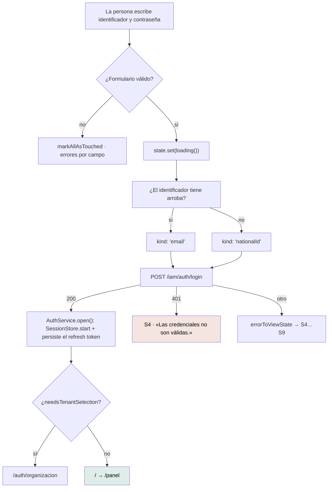

# `/auth` — Iniciar sesión

`src/app/features/auth/login/login.ts` · `Login` · `app-login`

---

## 1 · Propósito

Abrir sesión. Es la puerta de entrada de los tres actores y el destino de
cualquier expulsión: el `authGuard` manda acá a quien no tiene sesión, y el
interceptor a quien la perdió.

## 2 · Acceso y permisos

| Aspecto | Valor |
|---|---|
| Guard | Ninguno |
| Sesión | No requiere |
| Render | **Prerender** — se ve igual para todo el mundo |
| Título | «Mantra Core Health - Iniciar sesión» |
| `pathMatch` | `full` |

## 3 · Flujo



### Un solo campo de identificador

El backend acepta correo **o** documento y nunca ambos (`LoginDto` valida el
correo solo cuando no vino documento). Pedir dos campos obligaría a la persona a
saber cuál le toca. La arroba decide, que es la misma regla que usaría cualquiera
al mirarlo.

El tipo lo hace cumplir: `LoginCredentials` es una unión discriminada, así que
mandar los dos **no compila**.

## 4 · Estados de interfaz

| Estado | Cuándo | Qué se ve |
|---|---|---|
| Inicial (`ready(null)`) | Al entrar | Formulario utilizable. No hay nada que esperar |
| S2 `loading` | Mientras la petición viaja | El botón «Entrar» en modo carga (`isLoading`) |
| S4 `validation` | Credenciales inválidas, o cualquier `VALIDATION_FAILED`/`CONFLICT`/`RATE_LIMITED` | `app-alert` con tono de error sobre el formulario |
| S8 `offline` | La petición no llegó | «No pudimos conectarnos. Revisá tu conexión y reintentá.» |
| S9 `error` | Fallo inesperado | Mensaje + `(requestId)` entre paréntesis |
| Errores por campo | Campo tocado e inválido | Mensaje bajo el campo, vía `app-form-field` |

**Esta pantalla no usa `ViewStateHost`**: los estados se pintan con un
`app-alert` propio, porque el contenido (el formulario) tiene que seguir visible
y utilizable mientras se muestra el error. El host reemplaza el contenido; acá no
corresponde.

### La excepción del login

En cualquier otra pantalla, `UNAUTHENTICATED` significa que la sesión venció y el
interceptor ya la cerró. Acá significa que **las credenciales recién escritas no
sirven**, que es un mensaje distinto y accionable:

```ts
if (body?.code === 'UNAUTHENTICATED') {
  return validation([{ message: 'Las credenciales no son válidas.', code: body.code }]);
}
```

## 5 · Contratos de datos

### `POST /iam/auth/login`

Petición — uno de los dos identificadores, nunca ambos:

```jsonc
{ "email": "…", "password": "…", "mfaCode": "…" }   // o
{ "nationalId": "…", "password": "…", "mfaCode": "…" }
```

`mfaCode` se omite del cuerpo si está vacío: el backend valida con
`forbidNonWhitelisted`.

Respuesta:

```jsonc
{ "accessToken": "…", "refreshToken": "…", "expiresAt": "2026-08-01T…Z" }
```

`expiresAt` llega como texto y el cliente lo convierte a `Date`.

Errores tratados: `UNAUTHENTICATED` (S4 propio), `VALIDATION_FAILED`,
`RATE_LIMITED` (con `Retry-After`), estado 0 (S8), resto (S9).

## 6 · Componentes

`AuthSplit` · `AppButton` · `Input` · `Link` · `FormField` · `Alert` ·
`ReactiveFormsModule` · `RouterLink`

`AuthSplit` es el organismo de dos columnas: marca a un lado, formulario al otro.
El reclamo es «Tu salud, conectada».

## 7 · Analítica

**Ninguna.** No hay telemetría en el proyecto: ni un evento de intento de inicio
de sesión, ni de fallo, ni de éxito. Ver
[eventos analíticos](../observability/analytics-events.md).

## 8 · Accesibilidad

| Aspecto | Estado |
|---|---|
| `autocomplete` | `username`, `current-password`, `one-time-code` — los tres correctos |
| Nombre accesible de cada campo | Vía `app-form-field` y el contrato `FORM_CONTROL_CONTEXT` |
| Errores anunciados | `errorMessage` de `app-form-field` va en `aria-describedby` |
| `novalidate` | Sí: la validación es de la aplicación, no del navegador |
| Encabezado | `<h1>Iniciar sesión</h1>` |
| Foco al aparecer el error general | **No se mueve.** El `app-alert` aparece arriba del formulario sin llevar el foco |

Esa última fila es una diferencia real con `ViewStateHost`, que **sí** mueve el
foco al mensaje en S4. Registrada como brecha `MEDIUM` en
[la auditoría de accesibilidad](../accessibility/audit-report.md).

### El campo de MFA

Siempre visible y rotulado «(opcional)». El backend acepta `mfaCode` pero **no
emite ninguna señal** de cuándo hace falta: no hay código de error propio en el
catálogo. Antes esto se resolvía olfateando el texto de la respuesta, que era
adivinar. Mostrarlo siempre como opcional no inventa nada.

Hay un `TODO` en el código para ocultarlo cuando el backend declare el caso.

## 9 · Pruebas

`src/app/features/auth/login/login.spec.ts` — existe y pasa.

Cubre: detección correo/documento por la arroba, envío bloqueado con formulario
inválido, traducción del 401 al mensaje propio, navegación según
`needsTenantSelection`.

**Sin prueba E2E** — no hay ninguna en el proyecto.

## 10 · Notas operativas

- **Es el destino de toda expulsión.** `LOGIN_ROUTE = '/auth'` se declara en
  `core/http/auth.interceptor.ts` y lo importan el guard y `ShellLayout`.
- **Prerenderizada.** Un cambio en esta pantalla exige `yarn build` para que el
  HTML estático se regenere.
- **Un comentario del código está desactualizado.** La cabecera de la clase dice
  que no hay enlace de «olvidé mi contraseña» porque la API no tenía el endpoint.
  **Lo tiene, y el enlace está en la plantilla.** Registrado como deriva D1 en
  [la auditoría de estructura](../reports/graphify-audit.md#d1--un-comentario-de-logints-contradice-al-propio-código).
- **Si el login funciona y a la siguiente petición te saca**, no es esta
  pantalla: ver [solución de problemas](../getting-started/troubleshooting.md#entro-y-me-vuelve-a-sacar-al-login).
