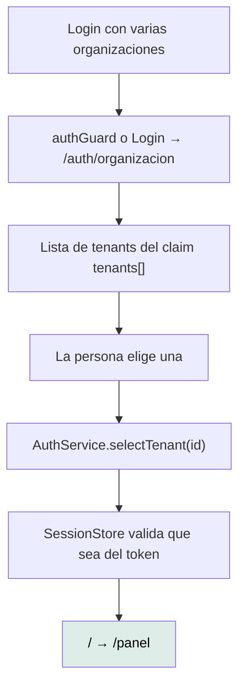

# `/auth/organization` — Elegir organización

`src/app/features/auth/tenant-selection/tenant-selection.ts` · `TenantSelection`
· `app-tenant-selection`

---

## 1 · Propósito

Cuando el token de sesión trae **más de una** organización, esta pantalla pide
que se elija cuál usar antes de entrar.

Es una pantalla propia y no un desplegable dentro del login porque la elección
**cambia qué datos se ven**: mezclarla con las credenciales invita a pasarla por
alto.

## 2 · Acceso y permisos

| Aspecto | Valor |
|---|---|
| Guard | **Ninguno** |
| Sesión | No la exige el router, pero sin ella no hay nada que elegir |
| Render | Cliente — la lista sale del token, que el servidor no ve |
| Título | «Mantra Core Health - Elegí tu organización» |
| Constante que la nombra | `TENANT_SELECTION_ROUTE` en `core/auth/auth.guard.ts` |

> **Sin guard, a propósito o por olvido — no está registrado.** Entrar
> directamente a esta URL sin sesión muestra la pantalla con **cero
> organizaciones**: `auth.tenants()` devuelve `[]`. No es una filtración (no hay
> nada que mostrar) pero tampoco es un estado útil: no hay mensaje ni salida.
> Brecha `MEDIUM` en [el análisis de brechas](../reports/documentation-gap-analysis.md).

## 3 · Flujo



Se llega por dos caminos, y los dos son del mismo hecho:

1. `Login.goAfterLogin()` cuando `needsTenantSelection()` es `true`.
2. `authGuard`, si alguien navega a una ruta protegida sin haber elegido.

### La elección se valida

```ts
selectTenant(tenantId: string): void {
  if (this.tenants().includes(tenantId)) {
    this.selectedTenantId.set(tenantId);
  }
}
```

Un identificador que no esté en el token se ignora en silencio. La autoridad
sigue siendo la API: `X-Tenant-Id` con un valor ajeno sería rechazado del otro
lado igual.

## 4 · Estados de interfaz

| Estado | Cuándo | Qué se ve |
|---|---|---|
| Lista | Sesión con varias organizaciones | Un botón por organización |
| Lista vacía | Sin sesión, o token sin `tenants[]` | **Nada útil.** Ver la brecha de arriba |

Esta pantalla **no usa `ViewState`**: no hace ninguna petición, así que no hay
carga, ni error, ni vacío que traducir. Toda su información sale del token.

## 5 · Contratos de datos

**Ninguna petición.** Todo sale del access token ya decodificado:

| Claim | Uso |
|---|---|
| `tenants[]` | La lista |
| `tenantNames{}` | El nombre legible de cada una |

```ts
nombre(tenantId: string): string {
  return this.session.tenantName(tenantId);   // cae al id si no hay nombre
}
```

Caer al identificador es feo, pero preferible a una fila vacía donde debería ir
una organización.

## 6 · Componentes

`AppButton` — y nada más. Es la pantalla más simple del proyecto.

## 7 · Analítica

**Ninguna.**

## 8 · Accesibilidad

| Aspecto | Estado |
|---|---|
| Cada opción es un `<button>` | Sí, vía `app-button`. Teclado y lector funcionan de fábrica |
| Encabezado | Sí |
| Estado vacío anunciado | **No.** Sin organizaciones no hay mensaje |
| Foco inicial | Por defecto del navegador |

## 9 · Pruebas

`tenant-selection.spec.ts` — existe y pasa.

**Sin prueba E2E.**

## 10 · Notas operativas

- **Cambiar de organización más tarde** no pasa por acá: se hace desde el
  `app-tenant-switcher` del encabezado, y `ShellLayout.changeTenant` vuelve al
  panel a propósito (es un cambio de contexto de datos).
- **La elección vive solo en memoria.** No se persiste: al recargar, si hay
  varias organizaciones, el guard vuelve a mandar acá. Es deliberado —
  `SessionStore.start()` descarta la elección anterior — pero significa que
  **quien tenga varias organizaciones pasa por esta pantalla en cada recarga**.
  Registrado como brecha `MEDIUM`; persistir la elección es un cambio de
  producto.
- `renew()` **no** toca la elección: la rotación del token es transparente.
