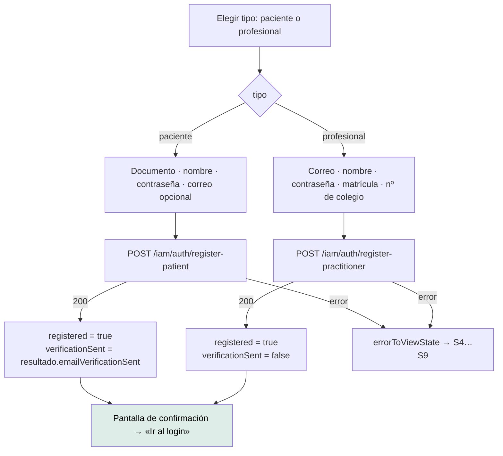

# `/auth/registro` — Crear cuenta

`src/app/features/auth/register-patient/register-patient.ts` · `RegisterPatient`
· `app-register-patient`

> El nombre del archivo dice «patient», pero la pantalla da de alta **dos
> perfiles**. Quedó del momento en que solo existía el de paciente.

---

## 1 · Propósito

Auto-registro, para los dos perfiles que la API permite dar de alta sin
intervención de un administrador: paciente y profesional de salud.

## 2 · Acceso y permisos

| Aspecto | Valor |
|---|---|
| Guard | Ninguno |
| Sesión | No requiere. **No la abre tampoco** |
| Render | **Prerender** |
| Título | «Mantra Core Health - Crear cuenta» |

## 3 · Flujo



### Dos formularios, no uno condicional

Es la decisión de diseño de esta pantalla, y está escrita en el código:

> *«Los campos obligatorios no se solapan y mezclarlos obligaría a validar
> "obligatorio si el tipo es…", que es de donde salen los formularios que
> mienten.»*

| | Paciente | Profesional |
|---|---|---|
| Identificador de acceso | **Documento** | **Correo** |
| Correo | Opcional, no condiciona el acceso | Obligatorio |
| Matrícula (`licenseNumber`) | — | **Obligatoria** |
| Nº de colegio (`credentialNumber`) | — | **Obligatorio** |
| Título profesional, teléfono | — | Opcionales |

*Un profesional sin habilitación comprobable no es un profesional.*

### El registro no abre sesión

Ninguno de los dos endpoints devuelve tokens: devuelven los identificadores del
perfil. Entrar automáticamente exigiría un segundo viaje con las credenciales
recién escritas, así que la pantalla lleva al login y le dice a la persona con
qué va a entrar (`accessHint`: «tu documento» o «tu correo»).

## 4 · Estados de interfaz

| Estado | Cuándo | Qué se ve |
|---|---|---|
| Formulario | Al entrar | Selector de tipo + el formulario correspondiente |
| S2 `loading` | Enviando | Botón en modo carga |
| Confirmación | `registered() === true` | Reemplaza el formulario. Dice con qué entrar y si se envió verificación |
| S4 `validation` | Datos rechazados por el backend | `app-alert` sobre el formulario |
| S8 / S9 | Red o servidor | Mensajes propios de la pantalla |
| Errores por campo | Campo tocado e inválido | Bajo cada campo |

Cambiar de tipo **limpia el error anterior**: era de otro formulario.

## 5 · Contratos de datos

### `POST /iam/auth/register-patient`

```jsonc
// petición — email, birthDate y timeZone se omiten si no vienen
{ "nationalId": "…", "password": "…", "displayName": "…", "email": "…" }

// respuesta
{ "userId": "…", "personId": "…", "patientProfileId": "…",
  "patientCode": "…", "emailVerificationSent": false }
```

`emailVerificationSent: false` **no es un fallo**: significa que no se aportó
correo.

### `POST /iam/auth/register-practitioner`

```jsonc
// petición
{ "email": "…", "password": "…", "displayName": "…",
  "licenseNumber": "…", "credentialNumber": "…",
  "professionalTitle": "…", "phone": "…" }        // los dos últimos, opcionales

// respuesta
{ "userId": "…", "personId": "…", "practitionerProfileId": "…", "practitionerCode": "…" }
```

El alta de profesional **no encola verificación de correo**, y la pantalla lo
refleja fijando `verificationSent` en `false`.

### Validaciones de cliente, espejo de los DTO del backend

| Regla | Valor | Espeja |
|---|---|---|
| Contraseña mínima | 8 caracteres | `MIN_PASSWORD` |
| Documento mínimo | 4 caracteres | `MIN_DOCUMENTO` |
| Documento admitido | `/^[A-Za-z0-9.-]+$/` | El mismo `@Matches` del backend |
| Correo | `Validators.email` | |

Son una comodidad, no la autoridad: el backend valida igual.

## 6 · Componentes

`AuthSplit` · `AppButton` · `Input` · `Link` · `Radio` · `RadioGroup` ·
`FormField` · `Alert` · `ReactiveFormsModule` · `RouterLink`

Es la única pantalla que importa por el alias `@shared/…` (para `Radio` y
`RadioGroup`); el resto usa rutas relativas. Ver
[reglas de composición](../components/composition-rules.md#el-barril-y-las-rutas-profundas).

### La marca cambia con el tipo

El diseño original era solo de profesional («Potenciá tu práctica médica»), pero
la pantalla sirve a los dos perfiles. Prometerle eso a alguien que se registra
como paciente sería hablarle de otra cosa:

| Tipo | Reclamo |
|---|---|
| Paciente | «Tu salud, en un solo lugar» |
| Profesional | «Potenciá tu práctica médica» |

## 7 · Analítica

**Ninguna.** Ni de embudo de registro, ni de abandono, ni de tipo elegido.

## 8 · Accesibilidad

| Aspecto | Estado |
|---|---|
| Selector de tipo | `app-radio-group` — nombrado con `aria-labelledby`, no con `for`/`id`, porque un grupo de radios no es «etiquetable» |
| Nombre accesible de cada campo | Vía `FORM_CONTROL_CONTEXT` |
| `aria-required` | Lo emite `app-form-field` desde su entrada `required` |
| Foco al aparecer el error | **No se mueve** — igual que en el login |
| Confirmación | Reemplaza el formulario. **El foco no se mueve al mensaje**, así que un lector de pantalla puede no anunciar el cambio |

Las dos últimas son brechas `MEDIUM` en
[la auditoría de accesibilidad](../accessibility/audit-report.md).

## 9 · Pruebas

`register-patient.spec.ts` — existe y pasa. Cubre los dos formularios, el cambio
de tipo, la omisión de campos vacíos y la traducción de errores.

**Sin prueba E2E.**

## 10 · Notas operativas

- **El nombre del archivo miente sobre su alcance.** Renombrarlo a
  `register/` sería lo correcto, pero es un cambio de producto (toca rutas de
  import en varios archivos). Registrado como brecha `LOW`.
- **La API tiene un tercer registro que la interfaz no ofrece:**
  `/iam/auth/register-organization` está en la lista de rutas públicas del
  interceptor, pero ningún cliente lo llama. Ver
  [el mapa de integraciones](../architecture/integration-map.md#2--cómo-viaja-la-credencial).
- **Prerenderizada**: un cambio exige `yarn build`.
