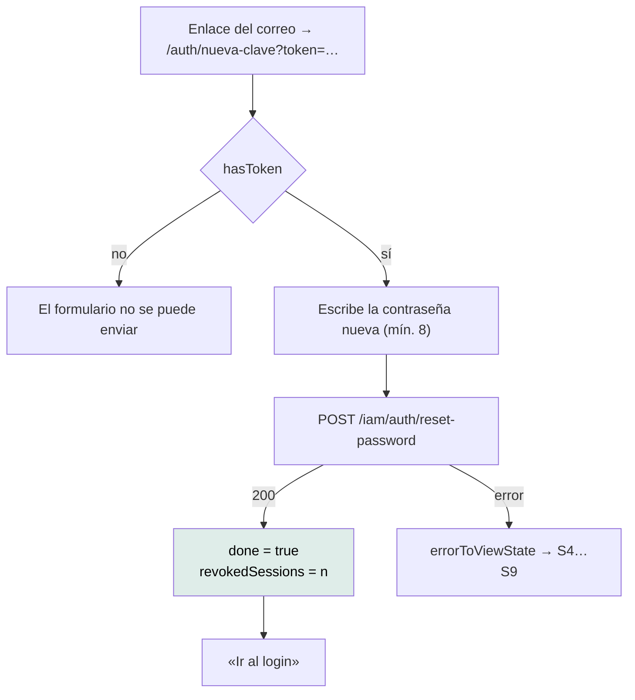

# `/auth/reset-password` — Fijar contraseña nueva

`src/app/features/auth/reset-password/reset-password.ts` · `ResetPassword` ·
`app-reset-password`

---

## 1 · Propósito

Segunda mitad de la recuperación: consume el token que llegó por correo y fija la
contraseña nueva.

## 2 · Acceso y permisos

| Aspecto | Valor |
|---|---|
| Guard | Ninguno |
| Sesión | No requiere — quien olvidó su contraseña no puede entrar |
| Render | **Cliente** — el token viene por query string, que en el build no existe |
| Título | «Mantra Core Health - Nueva contraseña» |
| Entrada | `?token=…` |

## 3 · Flujo



El token se lee una sola vez, en la construcción del componente:

```ts
private readonly token = this.route.snapshot.queryParamMap.get('token') ?? '';
readonly hasToken = this.token.trim() !== '';
```

`submit()` comprueba `hasToken` además de la validez del formulario: sin token no
hay nada que hacer, el enlace del correo llegó incompleto.

## 4 · Estados de interfaz

| Estado | Cuándo | Qué se ve |
|---|---|---|
| Formulario | Con token | Campo de contraseña nueva |
| Sin token | `hasToken === false` | El envío está bloqueado |
| S2 `loading` | Enviando | Botón en modo carga |
| Confirmación (`done`) | Tras un 200 | Reemplaza el formulario. Incluye cuántas sesiones se cerraron |
| S4 `validation` | Token vencido o ya usado, contraseña rechazada | `app-alert` |
| S8 / S9 | Red o servidor | Mensajes propios |

### Se muestra cuántas sesiones se cerraron

```ts
readonly revokedSessions = signal(0);
```

Con el motivo escrito en el código:

> *«Es información de seguridad que la persona quiere ver: si cambió la clave
> porque sospechaba de un acceso ajeno, saber que se cerraron tres sesiones le
> confirma que sirvió.»*

## 5 · Contratos de datos

### `POST /iam/auth/reset-password`

```jsonc
// petición
{ "token": "…", "newPassword": "…" }

// respuesta
{ "userId": "…", "revokedSessions": 3 }
```

Validación de cliente: `Validators.minLength(8)`, espejo de `ResetPasswordDto`.

> **Esta ruta NO está en la lista de rutas públicas del interceptor.** No lo
> necesita —quien la llama no tiene sesión, así que `withCredentials` no añade
> `Authorization` cuando `accessToken()` es `null`— pero significa que **si
> alguien con sesión abierta usa el enlace, su 401 sí dispararía un refresco**.
> Es un caso de borde sin consecuencia observada; anotado como brecha `LOW`.

## 6 · Componentes

`AppButton` · `Input` · `Link` · `FormField` · `Alert` · `ReactiveFormsModule` ·
`RouterLink`

Igual que `ForgotPassword`, **sin `AuthSplit`**.

## 7 · Analítica

**Ninguna.**

## 8 · Accesibilidad

| Aspecto | Estado |
|---|---|
| `autocomplete` | Debe ser `new-password` para que el gestor de contraseñas ofrezca generar una |
| Nombre accesible | Vía `FORM_CONTROL_CONTEXT` |
| Estado «sin token» anunciado | El formulario está, pero no se envía. **Sin mensaje explícito** |
| Confirmación anunciada | **No** mueve el foco ni usa `aria-live` |

Las dos últimas son brechas `MEDIUM`. La de «sin token» es la más molesta: quien
llegue con un enlace roto ve un formulario que parece funcionar y no lo hace.

## 9 · Pruebas

`reset-password.spec.ts` — existe y pasa. Cubre la ausencia de token, el mínimo
de longitud y la exposición de `revokedSessions`.

**Sin prueba E2E.**

## 10 · Notas operativas

- **El token es de un solo uso.** Un segundo envío con el mismo token devuelve
  error y la pantalla lo muestra como S4.
- **Cambiar la contraseña cierra las demás sesiones**, del lado del servidor. La
  sesión actual —si la hubiera— también quedaría inválida, y el interceptor
  mandaría al login en la siguiente petición.
- **El dominio del enlace lo arma la API.** Ver la nota equivalente en
  [`/auth/verify-email`](auth-verify-email.md#10--notas-operativas).
