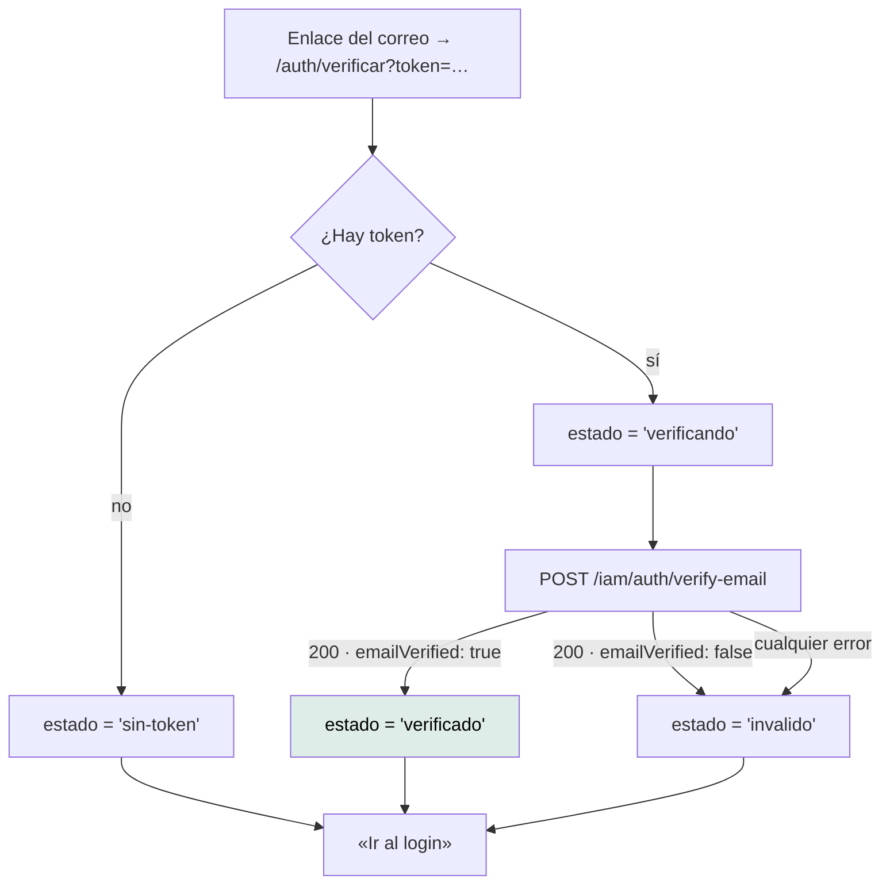

# `/auth/verificar` — Verificar correo

`src/app/features/auth/verify-email/verify-email.ts` · `VerifyEmail` ·
`app-verify-email`

---

## 1 · Propósito

Landing a la que lleva el enlace del correo de verificación. Canjea el token del
query string y muestra el resultado.

**Verificar el correo no desbloquea nada**: la cuenta ya está activa desde el
registro. Solo deja constancia de que la dirección es alcanzable por su titular.
Por eso, cuando el token no sirve, el mensaje no es alarmante — no se perdió el
acceso a nada.

## 2 · Acceso y permisos

| Aspecto | Valor |
|---|---|
| Guard | Ninguno |
| Sesión | No requiere |
| Render | **Cliente** — ver abajo |
| Título | «Mantra Core Health - Verificar correo» |
| Entrada | `?token=…` |

### Por qué no se prerenderiza

En el build no hay query string. El HTML generado se congelaría en el estado
«falta el código», y eso es lo que vería todo el mundo antes de hidratar.

## 3 · Flujo



El canje ocurre en el **constructor**, leyendo `route.snapshot.queryParamMap`.
Es correcto acá: a esta ruta se llega desde un enlace externo y nunca se navega
entre dos instancias distintas.

## 4 · Estados de interfaz

Esta pantalla **no usa `ViewState`**: tiene una máquina de cuatro estados propia,
más simple y más adecuada.

| `Estado` | Cuándo | Tono |
|---|---|---|
| `verificando` | Petición en vuelo | Neutro. `isVerifying()` lo expone a la plantilla |
| `verificado` | `emailVerified === true` | Éxito |
| `sin-token` | El enlace llegó sin `?token=` o vacío | Informativo, no alarmante |
| `invalido` | `emailVerified === false` **o cualquier error** | Informativo, no alarmante |

### Todos los fallos se cuentan igual

```ts
error: () => this.estado.set('invalido'),
```

Con el motivo en el código: *«el token venció, ya se usó o no existe.
Distinguirlos no le cambia nada a quien está mirando la pantalla.»*

Y hay una razón de seguridad además de una de simplicidad: distinguir «este token
no existe» de «este token ya se usó» le diría a un tercero algo sobre tokens que
no son suyos.

## 5 · Contratos de datos

### `POST /iam/auth/verify-email`

```jsonc
// petición
{ "token": "…" }

// respuesta
{ "userId": "…", "emailVerified": true }
```

Ruta **pública** en el interceptor: no lleva `Authorization` y su 401 no dispara
ningún refresco.

## 6 · Componentes

`AppButton` — y nada más.

## 7 · Analítica

**Ninguna.** No se sabe cuántos enlaces de verificación se abren ni cuántos
fallan.

## 8 · Accesibilidad

| Aspecto | Estado |
|---|---|
| Encabezado | Sí |
| Cambio de estado anunciado | **No.** No hay `aria-live` en esta pantalla; la transición de «verificando» a «verificado» puede pasar inadvertida a un lector de pantalla |
| Salida siempre disponible | Sí: el botón «Ir al login» está en los cuatro estados |

La segunda fila es brecha `MEDIUM`. `ViewStateHost` sí tiene `aria-live="polite"`
en su host; esta pantalla no lo usa.

## 9 · Pruebas

`verify-email.spec.ts` — existe y pasa. Cubre los cuatro estados, incluido el
token ausente y el token en blanco.

**Sin prueba E2E** — y es de las que más la necesitarían, porque el flujo
completo atraviesa el correo.

## 10 · Notas operativas

- **El enlace lo arma la API**, no el frontend. Si el dominio del enlace no
  coincide con dónde está desplegado el frontend, la landing no se alcanza. Es
  una coordinación entre repositorios que hoy no está documentada en ninguno.
- **La pantalla no reintenta.** Un fallo de red se ve igual que un token
  inválido. Es el precio de colapsar los errores, y es aceptable dado que la
  verificación no desbloquea nada.
- Si el token es válido pero el backend responde `emailVerified: false`, se
  muestra `invalido`. Esa combinación no debería ocurrir; si ocurre, es del lado
  de la API.
