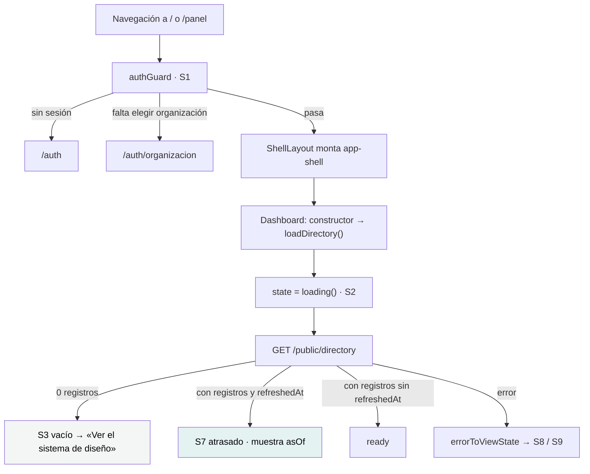

# `/panel` — Panel

`src/app/features/dashboard/dashboard.ts` · `Dashboard` · `app-dashboard`
Layout padre: `src/app/features/shell-layout/shell-layout.ts` · `ShellLayout`

---

## 1 · Propósito

La primera pantalla de la aplicación autenticada. Muestra **dos cosas, y las dos
son ciertas y verificables en el momento**:

1. **La sesión**, tal como el token la declara: identificador, roles y
   organización activa. Sin ninguna petición, porque la API no expone `/me`.
2. **Una lectura real contra la API** —el directorio público— que atraviesa el
   proxy, el interceptor y la traducción de errores. Es la prueba de punta a
   punta de que el frontend habla con el backend.

Reemplaza la pantalla de bienvenida del generador de Angular («Congratulations!
Your app is running»), que era literalmente lo primero que veía cualquiera.

## 2 · Acceso y permisos

| Aspecto | Valor |
|---|---|
| Guard | `authGuard`, **heredado del padre** `/` |
| Sesión | Requiere |
| Organización | Requiere una resuelta, o el guard manda a elegir |
| Render | Cliente — tiene sesión, y el servidor no la ve |
| Título | «Mantra Core Health - Panel» |

### El armazón

La ruta `/` monta `ShellLayout`, que **no es una pantalla**: es el layout con
sesión. El `<router-outlet />` de las hijas vive dentro de `app-shell`, en su
`<main>`, «así el enlace de salto, el anuncio de ruta y el foco quedan resueltos
para todas las pantallas».

`ShellLayout` es quien conoce usuario, organizaciones y rutas; `app-shell` es
puro organismo y los recibe.

```ts
protected readonly sections = computed<readonly NavSection[]>(() => [
  { label: 'General',      items: [{ label: 'Panel', route: '/panel', icon: 'home' }] },
  { label: 'Herramientas', items: [{ label: 'Sistema de diseño', route: '/design-system', icon: 'settings' }] },
]);
```

El menú tiene **lo que existe de verdad**. Las 81 secciones del modelo se irán
agregando a medida que sus pantallas se escriban: un ítem que lleva a una ruta
vacía es peor que no tenerlo.

> **El menú no está filtrado por rol hoy.** El comentario del código anticipa que
> lo estará («`sections` se recalcula a partir de los roles del token»), pero la
> implementación actual devuelve las dos secciones fijas. Y aunque lo estuviera:
> *esconder un ítem no protege nada*. La autoridad es la API.

## 3 · Flujo



## 4 · Estados de interfaz

La tarjeta del directorio está envuelta en `app-view-state-host`, así que muestra
los nueve estados sin escribir una línea sobre ellos.

| Estado | Cuándo se produce de verdad | Qué se ve |
|---|---|---|
| S2 `loading` | Siempre, al entrar | Esqueleto de 4 líneas, con la forma de la lista |
| S3 `empty` | La proyección existe pero no tiene registros — **lo que devuelve hoy la base de desarrollo** | «El directorio público todavía no tiene registros publicados» + enlace a la vitrina |
| S7 `stale` | La proyección declara `refreshedAt` | Aviso con la fecha, **siempre visible**, y botón «Actualizar» |
| `ready` | Con registros y sin `refreshedAt` | El conteo de registros |
| S8 `offline` | La API no está levantada | «Sin conexión» + «Reintentar» |
| S9 `error` | 500 o cuerpo sin la forma del contrato | Mensaje + código de soporte copiable |

### Vacío gana sobre atrasado

```ts
if (projection.records.length === 0) return empty(…);
return projection.refreshedAt === null ? ready(projection) : stale(projection, projection.refreshedAt);
```

El orden importa, y el código lo explica: una proyección sin registros no tiene
nada que mostrar, así que anunciar su antigüedad sería decirle a la persona cuán
viejo es un dato que no está viendo.

Y `refreshedAt === null` resuelve como `ready`, no como `stale`: la vista nunca
se refrescó, así que **no hay antigüedad que declarar**. Inventar `new Date()`
sería afirmar que se calculó recién.

### La tarjeta de sesión no tiene estados

Sale entera de los claims. Si un rol falta, muestra «El token no declara ningún
rol»; si no hay organización activa, «Sin organización activa». No hay carga ni
error posibles.

## 5 · Contratos de datos

### `GET /public/directory`

```jsonc
// respuesta
{
  "slug": "directory",
  "records": [ { … } ],
  "refreshedAt": "2026-08-01T…Z",   // o null: la vista nunca se refrescó
  "generatedAt": "2026-08-01T…Z"    // cuándo se armó ESTA respuesta
}
```

Admite dos filtros opcionales (`city`, `specialty`) que **esta pantalla no usa**:
llama sin argumentos. Los filtros vacíos se omiten en vez de mandarse en blanco,
porque mandarlos filtraría por la cadena vacía en vez de no filtrar.

**Es el único módulo de la API legible sin sesión**, y por eso se eligió: no
transporta ningún dato clínico, así que sirve de verificación de punta a punta
sin riesgo.

`refreshedAt` es *el* dato que S7 obliga a mostrar. `generatedAt` no es lo mismo:
es cuándo se armó la respuesta, no cuándo se calculó el dato.

## 6 · Componentes

**Del panel:** `PageHeader` · `Card` · `Badge` · `Skeleton` · `ViewStateHost`

**Del armazón:** `Shell` (que compone `Header`, `SideNav`, `TenantSwitcher`,
`Menu`, `Avatar`…)

El encabezado de página no repite el nombre de la persona:

> *«el encabezado del shell ya lo muestra a dos centímetros de acá, y repetirlo
> hace que un lector de pantalla lo lea dos veces en la misma pantalla.»*

## 7 · Analítica

**Ninguna.** No hay evento de visita, ni de reintento, ni de cambio de
organización.

## 8 · Accesibilidad

| Aspecto | Estado |
|---|---|
| Enlace de salto al contenido | Sí — lo aporta `app-shell` |
| Anuncio de cambio de ruta | Sí — lo aporta `app-shell` |
| Gestión del foco entre rutas | Sí — lo aporta `app-shell` |
| Cambios de estado anunciados | Sí — `ViewStateHost` tiene `aria-live="polite"` en el host |
| Esqueleto no roba el foco | Sí, por diseño de `ViewStateHost` |
| Jerarquía de encabezados | `h1` del `PageHeader`, `h2` por tarjeta |
| Lista de definiciones para los datos de sesión | `<dl>/<dt>/<dd>`, que es el elemento correcto |
| Botón de menú visible solo en ancho chico | Sí, vía `Breakpoints` |

Es la pantalla más completa del proyecto en accesibilidad, porque hereda todo lo
que `app-shell` y `ViewStateHost` resuelven una sola vez.

## 9 · Pruebas

| Componente | Prueba |
|---|---|
| `Dashboard` | **No tiene `.spec.ts`** |
| `ShellLayout` | **No tiene `.spec.ts`** |
| `Shell`, `Header`, `SideNav`, `TenantSwitcher`, `ViewStateHost` | Sí |

Las dos ausencias son las más relevantes del proyecto: son **la única pantalla
autenticada** y **el layout de todo lo autenticado**. La cobertura de `features/`
(74,74 %) se sostiene porque las seis pantallas de `auth/` sí están probadas.

Brecha `HIGH` en [la estrategia de pruebas](../testing/strategy.md).

**Sin prueba E2E.**

## 10 · Notas operativas

- **Es el termómetro de la conexión con la API.** Si el panel muestra S8, el
  problema no es el frontend: ver
  [solución de problemas](../getting-started/troubleshooting.md#el-login-responde-pero-el-panel-no-carga-datos).
- **Cambiar de organización vuelve acá**, no recarga la pantalla actual: es un
  cambio de contexto de datos y lo que hubiera en pantalla corresponde a la
  organización anterior.
- **`loadDirectory()` se llama en el constructor.** No hay `ngOnInit` ni
  resolver. Al volver a la pantalla se vuelve a pedir: no hay caché.
- **El menú lateral es fijo.** Agregar una sección es editar `ShellLayout`, no
  un archivo de configuración.
