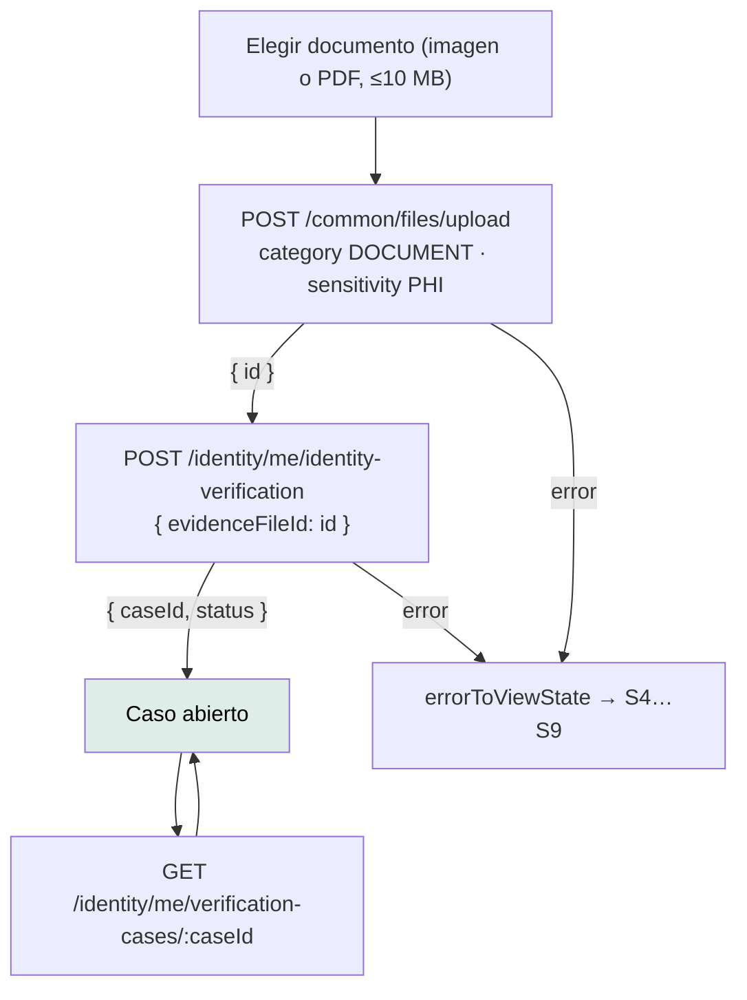

# `/identidad/verificar` — Verificar identidad

`src/app/features/identity-verification/identity-verification.ts` ·
`IdentityVerification` · `app-identity-verification`

---

## 1 · Propósito

Que el titular verifique su identidad subiendo su documento.

**Es el destino de la puerta del estado S5.** Cuando la API responde
`IDENTITY_VERIFICATION_REQUIRED`, `errorToViewState` ofrece «Verificar
identidad» y esta ruta la atiende.

> Hasta esta versión esa acción apuntaba a `/identity/me` —la ruta **de la
> API**, no del router—, así que no llevaba a ninguna parte: un muro con cartel
> de puerta. Era el hallazgo `HIGH` A11Y-02.

## 2 · Acceso y permisos

| Aspecto | Valor |
|---|---|
| Guard | `authGuard`, heredado del padre `/` |
| Sesión | **Requiere** |
| Render | Cliente |
| Título | «Mantra Core Health - Verificar identidad» |
| Menú | «General › Verificar identidad» |

**Nadie puede verificar la identidad de otro.** Ninguna ruta de `identity`
recibe a quién se verifica: el backend lo resuelve del usuario autenticado. Por
eso esta pantalla no tiene selector de persona, y no es un olvido.

## 3 · Flujo



Dos peticiones encadenadas: la segunda necesita el identificador de la primera.

## 4 · Estados de interfaz

| Estado | Cuándo | Qué se ve |
|---|---|---|
| Formulario | Sin caso abierto | Selector de archivo + botón |
| Rechazo local | El archivo pasa los límites del componente | `app-alert` de aviso, con el motivo traducido |
| S2 `loading` | Subiendo o abriendo el caso | Botón en modo carga |
| Caso abierto | Tras las dos peticiones | Estado, código del caso y botón «Actualizar estado» |
| S4 `validation` | Archivo rechazado por el backend, o `PAYLOAD_TOO_LARGE` | `app-alert` de error |
| S5 `forbidden` | No corresponde iniciar la verificación | Ídem, con el mensaje del servidor |
| S8 / S9 | Red o servidor | Mensajes propios, S9 con código de soporte |

**Los mensajes se anuncian.** El formulario y el caso abierto llevan la
directiva `appAnuncio`, así que un lector de pantalla se entera del error y de
la confirmación.

## 5 · Contratos de datos

### `POST /common/files/upload`

```text
multipart/form-data
  file          el documento
  category      DOCUMENT
  sensitivity   PHI
```

**`PHI` no es opcional acá.** Es un documento de identidad: cambia cómo se
guarda y quién puede descargarlo. El parámetro es obligatorio en
`FilesClient.upload` justamente para que la decisión se tome en cada llamada.

Y **el `Content-Type` no se fija a mano**: el navegador tiene que ponerlo él
para incluir el `boundary`.

### `POST /identity/me/identity-verification`

```jsonc
{ "evidenceFileId": "…" }        // → { caseId, checkId, status }
```

### `GET /identity/me/verification-cases/:caseId`

```jsonc
{ "id": "…", "status": "…", "openedAt": "…", "completedAt": "…" }
```

Las fechas llegan como texto y el cliente las convierte a `Date`.

## 6 · Componentes

`PageHeader` · `Card` · `FileInput` · `FormField` · `Alert` · `AppButton` ·
`StatusSeal` · `AnnounceOnAppear`

El estado del caso lo pinta `app-status-seal`: `case-status.ts` traduce el UUID
de concepto que emite el backend a una variante del sello y una palabra
(«Aprobado»), con fallback neutro para estados que esta versión no conoce.

`app-file-input` avisa **qué** rechazó y por qué (`rejected`), y deja el mensaje
a la pantalla: el componente no sabe qué límite es razonable en este contexto.

## 7 · Analítica

**Ninguna.** No hay telemetría en el proyecto.

## 8 · Accesibilidad

| Aspecto | Estado |
|---|---|
| Nombre accesible del selector | Vía `app-form-field` y `FORM_CONTROL_CONTEXT` |
| Límite anunciado antes de elegir | `hint`: «Imagen o PDF, hasta 10 MB» |
| Rechazo anunciado | `appAnuncio` sobre el aviso |
| Confirmación anunciada | `appAnuncio [asertivo]="false"` sobre la tarjeta del caso |
| Datos del caso | `<dl>/<dt>/<dd>`, que es el elemento correcto |
| Código del caso | `.tabular-nums` y `user-select: all`: se dicta y se copia |
| Enlace de salto, anuncio de ruta y foco | Heredados de `app-shell` |

## 9 · Pruebas

Los clientes que encadena (`FilesClient`, `IdentityClient`) ya tenían prueba.
La pantalla tiene su `identity-verification.spec.ts` propio: fija que la
evidencia se sube como PHI, el encadenado de las dos peticiones y que el sello
traduce el estado del caso a palabras. El mapeo completo UUID → presentación lo
fija `case-status.spec.ts`.

## 10 · Notas operativas

- **Sube PHI.** Cualquier cambio acá toca el manejo de información de salud
  protegida: ver [privacidad](../security/privacy.md).
- **El límite de 10 MB es del cliente.** El backend tiene el suyo, y responde
  `PAYLOAD_TOO_LARGE`, que se traduce a S4 con el mensaje «El archivo es
  demasiado grande».
- **No hay descarga.** Se puede subir la evidencia y no recuperarla. Para este
  flujo alcanza —la revisa la autoridad— pero es una ausencia registrada en
  [archivos](../integrations/file-storage.md).
- **El estado del caso no se actualiza solo.** Hay un botón. No hay sondeo ni
  tiempo real: ver [tiempo real](../integrations/realtime.md).
