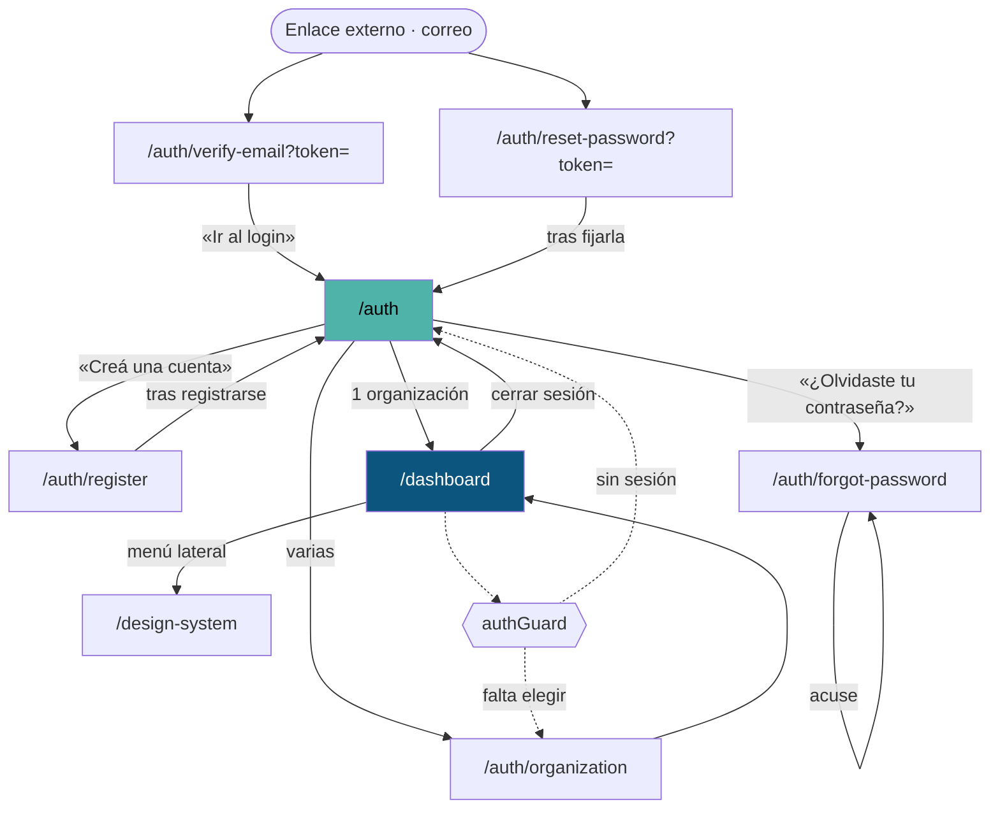

# Catálogo de rutas

Las 11 entradas de `src/app/app.routes.ts`, con su ficha completa. El inventario
automático está en
[el inventario de rutas generado](../reports/generated/route-inventory.md); esta
página es su lectura.

> **Adaptación de la estructura.** El plan maestro propone una carpeta por ruta
> con diez archivos dentro. Para ocho pantallas eso serían ochenta páginas, la
> mayoría de tres líneas — y el propio plan prohíbe las páginas vacías. Acá cada
> ruta tiene **una página con las diez secciones**: propósito, acceso, flujo,
> estados, contratos, componentes, analítica, accesibilidad, pruebas y notas
> operativas. La cobertura es la misma; la navegación, mejor.

---

## Tabla maestra

| URL | Pantalla | Acceso | Render | Datos | Ficha |
|---|---|---|---|---|---|
| `/` | `ShellLayout` (layout) | `authGuard` | Cliente | — | [ficha](dashboard.md#el-armazón) |
| `/dashboard` | `Dashboard` | `authGuard` | Cliente | `GET /public/directory` | [ficha](dashboard.md) |
| `/my-account/identity/verify` | `IdentityVerification` | `authGuard` | Cliente | subida + verificación | [ficha](identity-verify.md) |
| `/auth` | `Login` | Pública | **Prerender** | `POST /iam/auth/login` | [ficha](auth-login.md) |
| `/auth/register` | `RegisterPatient` | Pública | **Prerender** | `POST …/register-patient` · `…/register-practitioner` | [ficha](auth-register.md) |
| `/auth/organization` | `TenantSelection` | Pública* | Cliente | — (lee el token) | [ficha](auth-organization.md) |
| `/auth/verify-email` | `VerifyEmail` | Pública | Cliente | `POST /iam/auth/verify-email` | [ficha](auth-verify-email.md) |
| `/auth/forgot-password` | `ForgotPassword` | Pública | **Prerender** | `POST /iam/auth/forgot-password` | [ficha](auth-forgot-password.md) |
| `/auth/reset-password` | `ResetPassword` | Pública | Cliente | `POST /iam/auth/reset-password` | [ficha](auth-reset-password.md) |
| `/design-system` | `DesignSystemSample` | Pública | **Prerender** | — | [ficha](design-system.md) |
| `/error` | `ErrorRecovery` | Pública | Cliente | — | [ficha](error-y-404.md) |
| `**` | `NotFound` | Pública | Cliente | — | [ficha](error-y-404.md) |
| `''` (hija) | redirige a `/dashboard` | `authGuard` | — | — | — |

\* `/auth/organization` **no tiene guard**: es alcanzable sin sesión y en ese caso
muestra una lista vacía. Ver su ficha.

## Direcciones viejas · las rutas en castellano

El router pasó de castellano a inglés el **2026-08-11**, apuntando a un despliegue
fuera del país. Una dirección no es un identificador interno: está en los favoritos
de alguien, en un correo ya enviado y en el historial del navegador. Estas
redirecciones existen para que nada de eso se convierta en un 404.

Las declara `RUTAS_HEREDADAS` (dentro del armazón) y `RUTAS_HEREDADAS_PUBLICAS`
(a nivel raíz) en `src/app/app.routes.ts`. Todas llevan `pathMatch: 'full'`: sin
él, `administracion/pacientes` capturaría también `administracion/pacientes/<id>`
y lo mandaría al listado perdiendo el identificador en silencio, que es peor que
el 404.

**El router conserva el query string al redirigir**, y de eso depende que
`/auth/verificar?token=…` —el enlace del correo de verificación— siga funcionando.
Es la razón principal de que la tabla exista.

| Dirección vieja | Lleva a |
|---|---|
| `/panel` | `/dashboard` |
| `/agenda` | `/schedule` |
| `/clinico` | `/medical-records` |
| `/facturacion` | `/billing` |
| `/mi-cuenta` | `/my-account` |
| `/mi-cuenta/turnos` | `/my-account/appointments` |
| `/identidad/verificar` | `/my-account/identity/verify` |
| `/identidad/casos` | `/my-account/identity/cases` |
| `/administracion/pacientes` | `/administration/patients` |
| `/administracion/usuarios` | `/administration/users` |
| `/administracion/organizaciones` | `/administration/organizations` |
| `/administracion/acceso-delegado` | `/administration/delegated-access` |
| `/administracion/proveedores-identidad` | `/administration/identity-providers` |
| `/administracion/verificacion-identidad` | `/administration/identity-assurance` |
| `/administracion/terminologia` | `/administration/terminology` |
| `/auth/organizacion` | `/auth/organization` |
| `/auth/registro` | `/auth/register` |
| `/auth/verificar` | `/auth/verify-email` |
| `/auth/recuperar` | `/auth/forgot-password` |
| `/auth/nueva-clave` | `/auth/reset-password` |
| `/auth/activar` | `/auth/activate` |
| `/auth/reenviar-verificacion` | `/auth/resend-verification` |

Se redirigen **las raíces de sección y las landings públicas**, que es donde viven
los enlaces que salieron del producto. Las sub-rutas de los paneles de operación
no: a ellas se llega desde su panel, no desde un favorito.

**Retirada:** cuando deje de haber tráfico en estas direcciones. Tres pruebas de
`app.routes.spec.ts` las cuidan mientras tanto: que cada una lleve a una ruta que
existe, que se declaren después de toda pantalla, y que ninguna quede detrás del
comodín.

### La trampa que la migración destapó

Los nombres en castellano eran seguros **por accidente**: el proxy de la API está
en inglés. Al traducir aparecieron tres colisiones de golpe, porque el proxy
compara por inicio de ruta con `indexOf(...) === 0` —sin límite de segmento—, que
es el mismo motivo por el que `/admin` capturó `/administracion/pacientes` y dejó
la sección en blanco.

| Traducción ingenua | Prefijo de la API | Nombre adoptado |
|---|---|---|
| `clinical-record` | `/clinical` | **`medical-records`** |
| `identity/verify` · `identity/cases` | `/identity` | **`my-account/identity/*`** |
| `scheduling` | `/scheduling` | **`schedule`** |

Lo hace cumplir `node scripts/check-route-prefixes.mjs`, que corre en CI y dentro
del informe documental.

### La otra mitad de la regla: prefijos que faltan

Que ninguna ruta se coma un prefijo no dice nada de los prefijos que **no
están**. Una llamada de `core/data-access` cuyo prefijo no figure en el proxy la
responde el router de Angular con su `index.html` y un **200**, así que el
cliente recibe HTML donde espera JSON y el fallo sale como «error inesperado».

Medido el 2026-08-17: **39 operaciones de 258** estaban así —27 de ellas del
muro social, ya integrado en `dev`—, además del catálogo de servicios, las
aseguradoras, el laboratorio y las interacciones medicamentosas. Ninguna prueba
lo denunciaba: las unitarias de los clientes doblan `HttpClient` y nunca salen a
la red.

Lo hace cumplir `node scripts/check-client-prefixes.mjs`, en CI y en el informe
documental. Cuando el primer segmento colisiona con una ruta del armazón se usa
un prefijo de dos segmentos —`/billing/service-catalog`,
`/diagnostics/patients`— igual que `/admin/tenants`.

## Cobertura

| Métrica | Valor |
|---|---|
| Rutas declaradas | 13 |
| Rutas documentadas | **13 / 13 (100 %)** |
| Pantallas navegables | 11 |
| Con prueba de componente | 9 / 11 — faltan `IdentityVerification` y `NotFound` |
| Con carga diferida | 1 (`/design-system`) |
| Prerenderizadas | 4 |

`node scripts/check-doc-coverage.mjs` falla si se agrega una ruta sin ficha.

## Cómo se llega a cada pantalla

## Lo que ninguna ruta tiene

| Elemento | Estado |
|---|---|
| Parámetros de path (`:id`) | Ninguna ruta los declara |
| Resolvers | Ninguno |
| `canDeactivate` | Ninguno. Se puede salir de un formulario a medio llenar sin aviso |
| Guard por rol | Ninguno. El único guard mira sesión y organización |
| Pantalla 404 | **Existe**: el comodín monta `NotFound` |
| Metadatos de SEO (`description`, Open Graph) | Solo `title`. Ninguna ruta declara descripción |
| Analítica de navegación | No existe |

## Las 81 secciones del modelo

El modelo del proyecto (M34) contempla 81 secciones. **Hay 8 pantallas
implementadas.** El menú lateral lo dice sin rodeos en el código:

> *«Hoy tiene lo que existe de verdad: el panel y la vitrina del sistema de
> diseño. Las 81 secciones del modelo se van agregando a medida que sus pantallas
> se escriben — un ítem que lleva a una ruta vacía es peor que no tenerlo.»*
> — `features/shell-layout/shell-layout.ts`

Esta documentación cubre **el 100 % de lo implementado**. Lo planificado y no
construido no se documenta como si existiera: es la regla 3 del plan.
