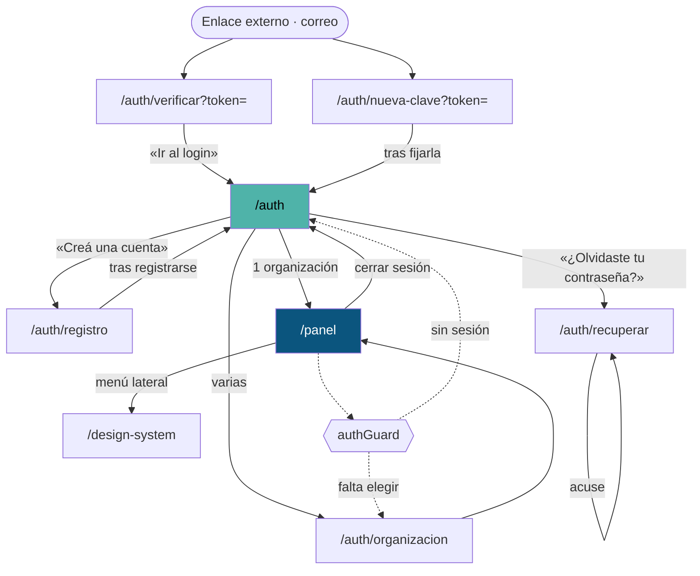

# Catálogo de rutas

Las 11 entradas de `src/app/app.routes.ts`, con su ficha completa. El inventario
automático está en
[el inventario de rutas generado](../reports/generated/route-inventory.md); esta
página es su lectura.

> **Adaptación de la estructura.** El plan maestro propone una carpeta por ruta
> con diez archivos dentro. Para ocho pantallas eso serían ochenta páginas, la
> mayoría de tres líneas — y el propio plan prohíbe las páginas vacías. Acá cada
> ruta tiene **una página con las diez secciones**: propósito, acceso, flujo,
> estados, contratos, componentes, analítica, accesibilidad, pruebas y notas
> operativas. La cobertura es la misma; la navegación, mejor.

---

## Tabla maestra

| URL | Pantalla | Acceso | Render | Datos | Ficha |
|---|---|---|---|---|---|
| `/` | `ShellLayout` (layout) | `authGuard` | Cliente | — | [ficha](panel.md#el-armazón) |
| `/panel` | `Dashboard` | `authGuard` | Cliente | `GET /public/directory` | [ficha](panel.md) |
| `/identidad/verificar` | `IdentityVerification` | `authGuard` | Cliente | subida + verificación | [ficha](identidad-verificar.md) |
| `/auth` | `Login` | Pública | **Prerender** | `POST /iam/auth/login` | [ficha](auth-login.md) |
| `/auth/registro` | `RegisterPatient` | Pública | **Prerender** | `POST …/register-patient` · `…/register-practitioner` | [ficha](auth-registro.md) |
| `/auth/organizacion` | `TenantSelection` | Pública* | Cliente | — (lee el token) | [ficha](auth-organizacion.md) |
| `/auth/verificar` | `VerifyEmail` | Pública | Cliente | `POST /iam/auth/verify-email` | [ficha](auth-verificar.md) |
| `/auth/recuperar` | `ForgotPassword` | Pública | **Prerender** | `POST /iam/auth/forgot-password` | [ficha](auth-recuperar.md) |
| `/auth/nueva-clave` | `ResetPassword` | Pública | Cliente | `POST /iam/auth/reset-password` | [ficha](auth-nueva-clave.md) |
| `/design-system` | `DesignSystemSample` | Pública | **Prerender** | — | [ficha](design-system.md) |
| `/error` | `ErrorRecovery` | Pública | Cliente | — | [ficha](error-y-404.md) |
| `**` | `NotFound` | Pública | Cliente | — | [ficha](error-y-404.md) |
| `''` (hija) | redirige a `/panel` | `authGuard` | — | — | — |

\* `/auth/organizacion` **no tiene guard**: es alcanzable sin sesión y en ese caso
muestra una lista vacía. Ver su ficha.

## Cobertura

| Métrica | Valor |
|---|---|
| Rutas declaradas | 13 |
| Rutas documentadas | **13 / 13 (100 %)** |
| Pantallas navegables | 11 |
| Con prueba de componente | 9 / 11 — faltan `IdentityVerification` y `NotFound` |
| Con carga diferida | 1 (`/design-system`) |
| Prerenderizadas | 4 |

`node scripts/check-doc-coverage.mjs` falla si se agrega una ruta sin ficha.

## Cómo se llega a cada pantalla

## Lo que ninguna ruta tiene

| Elemento | Estado |
|---|---|
| Parámetros de path (`:id`) | Ninguna ruta los declara |
| Resolvers | Ninguno |
| `canDeactivate` | Ninguno. Se puede salir de un formulario a medio llenar sin aviso |
| Guard por rol | Ninguno. El único guard mira sesión y organización |
| Pantalla 404 | **Existe**: el comodín monta `NotFound` |
| Metadatos de SEO (`description`, Open Graph) | Solo `title`. Ninguna ruta declara descripción |
| Analítica de navegación | No existe |

## Las 81 secciones del modelo

El modelo del proyecto (M34) contempla 81 secciones. **Hay 8 pantallas
implementadas.** El menú lateral lo dice sin rodeos en el código:

> *«Hoy tiene lo que existe de verdad: el panel y la vitrina del sistema de
> diseño. Las 81 secciones del modelo se van agregando a medida que sus pantallas
> se escriben — un ítem que lleva a una ruta vacía es peor que no tenerlo.»*
> — `features/shell-layout/shell-layout.ts`

Esta documentación cubre **el 100 % de lo implementado**. Lo planificado y no
construido no se documenta como si existiera: es la regla 3 del plan.
