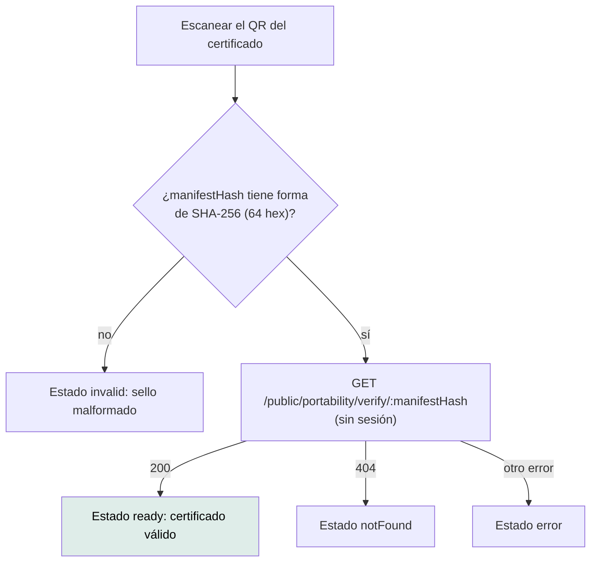

# `/verify/portability/:manifestHash` — Verificar certificado de portabilidad

`src/app/features/insurance/portability-verify/portability-verify.ts` ·
`PortabilityVerify` · `app-portability-verify`

---

## 1 · Propósito

Que cualquiera que reciba el certificado PDF de portabilidad de póliza y
siniestralidad (subtarea 3.3) —una nueva aseguradora, un auditor, el propio
paciente— confirme, escaneando su código QR, que el documento existe, con qué
sello fue emitido y por cuántos registros, sin necesitar sesión en AloVida.

**Es el destino del QR del certificado.** `InsurancePortabilityPdfService`
imprime `${WEB_APP_BASE_URL}/verify/portability/<hash>` al pie del PDF, junto
al mismo hash en texto (precedente: la receta oficial y su
`/public/prescriptions/:id/verify`, con la diferencia de que la receta **no**
tiene todavía página pública propia en el front — ésta es la primera).

## 2 · Acceso y permisos

| Aspecto | Valor |
|---|---|
| Guard | Ninguno — declarada **fuera** del armazón (`ShellLayout`/`authGuard`), junto a `design-system` |
| Sesión | **No requiere** (ni ofrece: no hay nada que autenticar) |
| Render | Cliente, `loadComponent` diferido |
| Título | «AloVida - Verificar certificado» |
| Menú | Ninguno — se llega por el QR, nunca por navegación |

**No transporta ningún dato clínico ni personal.** El backend
(`GET /public/portability/verify/:manifestHash`) responde sólo
`{ status, certificateId, manifestHash, generatedAt, recordCount, algorithm,
issuer }` — mismo contrato sin PHI que `prescription-verification.dto.ts`. Quien
verifica compara el hash contra el que tiene impreso en el papel; la identidad
del paciente la aporta el documento físico, no esta pantalla.

## 3 · Flujo



La validación de forma es **del cliente**, antes de llamar a la API: un hash
mal escrito nunca sale como petición de red.

## 4 · Estados de interfaz

| Estado | Cuándo | Qué se ve |
|---|---|---|
| `loading` | Mientras responde la API | `app-skeleton` de texto, `role="status"` |
| `ready` | 200, certificado encontrado | «Certificado válido», fecha de emisión, cantidad de registros, algoritmo, hash monoespaciado |
| `notFound` | 404 | Aviso: puede estar mal escrito o no ser de AloVida |
| `invalid` | El segmento de ruta no tiene forma de SHA-256 | Aviso, **sin** llamar a la API |
| `error` | Cualquier otro código o fallo de red | Aviso genérico, «Intentá de nuevo» |

No hay S1 (nada que autorizar) ni S5/S6 (nada que ocultar): el certificado
existe o no existe, y decirlo no filtra nada sobre el paciente.

## 5 · Contratos de datos

### `GET /public/portability/verify/:manifestHash`

```jsonc
// 200
{
  "status": "VALID",
  "certificateId": "…",
  "manifestHash": "e3b0c442…",
  "generatedAt": "2026-09-18T18:00:00.000Z",
  "recordCount": 14,
  "algorithm": "SHA-256",
  "issuer": "AloVida"
}
```

`404` si el hash no corresponde a ningún manifiesto; `400` si el pipe de
validación del backend lo rechaza por forma (esta pantalla nunca llega a
mandarlo: valida antes). `Cache-Control: no-store` en la respuesta.

`InsurancePortabilityClient.verifyCertificate(manifestHash)` convierte
`generatedAt` a `Date`.

## 6 · Componentes

`Alert` · `Skeleton` · `AppButtonLink` (`a[app-button]`, `routerLink="/"`)

Sin `FormField` ni control de formulario: la página no pide nada, sólo lee el
segmento de la URL.

## 7 · Analítica

**Ninguna.** No hay telemetría en el proyecto.

## 8 · Accesibilidad

| Aspecto | Estado |
|---|---|
| Carga anunciada | `role="status"` + `aria-label="Verificando certificado"` sobre el esqueleto |
| Resultado | `app-alert` con `tone`/`title` por estado (semántica ya accesible del átomo) |
| Hash | `<code>` monoespaciado, `user-select: all` (se copia entero con un solo click) |
| Navegación de vuelta | Enlace `app-button` real (`<a routerLink>`), no un botón sin destino |

## 9 · Pruebas

`portability-verify.spec.ts` cubre los 5 estados con `ActivatedRoute` y
`HttpTestingController` doblados: hash malformado (sin request), certificado
válido, 404, error 500 y el esqueleto de carga antes de que la petición
resuelva. El contrato del cliente (`verifyCertificate`) tiene su propia prueba
en `insurance-portability.client.spec.ts`.

## 10 · Notas operativas

- **`WEB_APP_BASE_URL` sin definir en el backend hace que el QR apunte a
  `localhost`.** Se documentó en `.env.example` de la API; en un despliegue
  real hay que fijarla al dominio público antes de emitir certificados.
- **Ruta literal, no `data.tipoDeCuenta` ni sección de menú**: como `feed` o
  `design-system`, se declara suelta porque no es un lugar al que se «vuelve»
  navegando — es un destino de enlace externo.
- **Sin listado «mis certificados».** Esta pantalla verifica un hash puntual;
  no hay, todavía, una vista donde el paciente vea el historial de sus propias
  exportaciones (deuda declarada de la subtarea 3.3).
