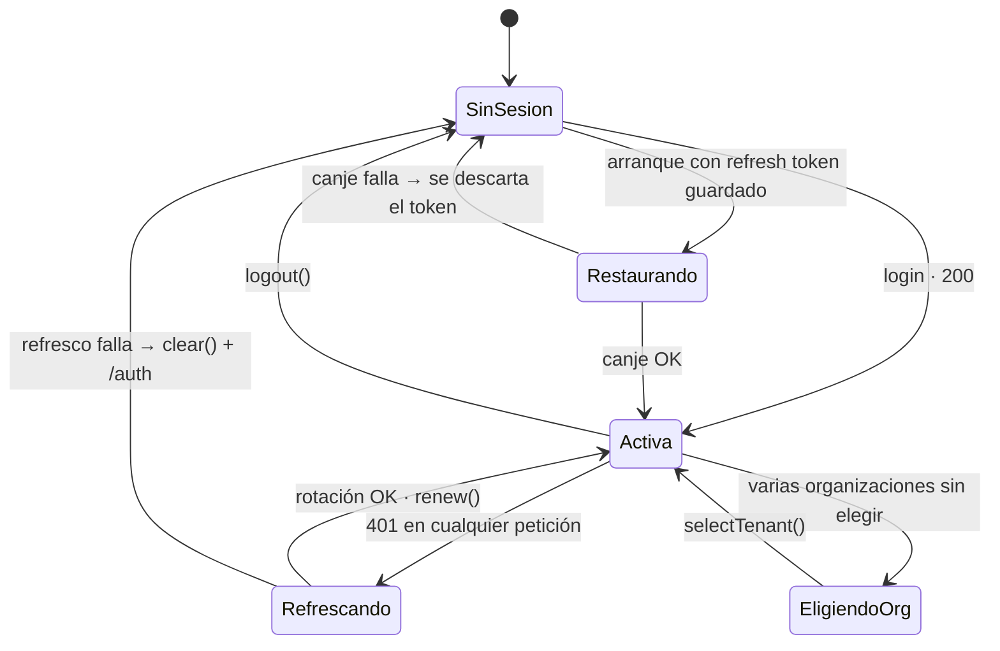

# Sesión y tokens

Dónde vive cada credencial, cómo se renueva y qué pasa cuando algo falla.

---

## El reparto

| Credencial | Dónde | Duración | Por qué ahí |
|---|---|---|---|
| **Access token** | Memoria (`SessionStore`) | Minutos (`exp` del JWT) | Dura poco y se vuelve a obtener. Guardarlo sería exponer de más sin ganar nada |
| **Refresh token** | `localStorage` (`mantra.refresh-token`) | La del servidor | Es lo único que hace que la sesión sobreviva a la recarga |

**No hay cookies.** La API entrega el refresh token **en el cuerpo del login**, así
que el frontend no puede convertirlo en `HttpOnly`: es una decisión del backend,
no una omisión de este repositorio.

## El ciclo



## Recuperación al arrancar

```ts
provideAppInitializer(() => inject(AuthService).restoreSession())
```

Corre **antes** de que el router evalúe el guard:

> *«Si no se esperara, alguien con sesión válida vería un parpadeo al login
> mientras el canje del refresh token está en vuelo. En el servidor no hay
> almacenamiento, así que resuelve de inmediato sin pedir nada.»*

Y cuando el canje falla:

```ts
catchError(() => {
  this.storage.clear();   // no reintentar en cada arranque contra el límite
  return of(false);
})
```

> *«un refresh token vencido o revocado no es un error que mostrar, es
> simplemente no haber iniciado sesión.»*

## Renovación: rotación completa, una sola en vuelo

`POST /iam/auth/token/refresh` **rota el par completo**: el token viejo deja de
servir. Eso convierte un robo en algo detectable del lado del servidor.

`TokenRefreshService` garantiza una sola petición en vuelo. Ver
[caché](../data-and-state/caching.md#lo-único-que-sí-deduplica).

### El reintento no recursa

```ts
return refresher.refresh().pipe(
  switchMap(() => next(withCredentials(request, session))),
  catchError((refreshError: unknown) => endSession(session, router, refreshError)),
);
```

> *«si la petición reintentada vuelve a dar 401, el error sube. Un interceptor que
> reintenta en bucle agota el límite de peticiones y deja la interfaz colgada sin
> decir nada.»*

## Cierre de sesión

```ts
logout(): void {
  this.iam.logout().subscribe({
    next:  () => this.clearLocal(),
    error: () => this.clearLocal(),
  });
}
```

**Se limpia local pase lo que pase**:

> *«si la petición falla, la persona igual quiso salir, y dejarla adentro por un
> error de red sería lo peor de los dos mundos. El token local se descarta y el
> del servidor caduca solo.»*

### `logout`, no `logout-all`

> *«esa otra ruta cierra las sesiones de **todos** sus dispositivos, que es otra
> intención.»*

Cerrar sesión en el teléfono no debería cerrar la del consultorio. Que la API
tenga las dos y el cliente use la correcta es una decisión, no un descuido.

## El tenant activo

```ts
readonly activeTenantId = computed<string | null>(() => {
  const chosen = this.selectedTenantId();
  if (chosen !== null) return chosen;
  const tenants = this.tenants();
  return tenants.length === 1 ? (tenants[0] ?? null) : null;
});
```

Con varias organizaciones y ninguna elegida devuelve `null`, y entonces
**`X-Tenant-Id` no se manda**. Adivinar podría mostrar datos de la organización
equivocada.

`renew()` no lo toca; `start()` sí lo descarta.

## Lectura del token

Sin verificar la firma, y por una razón:

> *«Verificarla en el cliente no aportaría nada: la clave es del servidor y quien
> pueda alterar el token también puede alterar el código que lo comprueba.»*

Ante cualquier anomalía devuelve `null` en vez de lanzar. Y **solo `sub` es
obligatorio**:

> *«exigirlos acá sería ser más estricto que el contrato: un token sin `sid` se
> leería como ilegible y sacaría al login a alguien con sesión válida, sin
> explicación.»*

## Riesgos, y qué falta

### 1 · El refresh token es alcanzable por XSS · `MEDIUM`

Cualquier script en el origen puede leer `localStorage`.

**Mitigado por:** cero `innerHTML`, cero scripts de terceros, 10 dependencias.
**Sin mitigar:** no hay CSP.
**No es del frontend:** convertirlo en cookie `HttpOnly` exige que la API deje de
entregarlo en el cuerpo.

### 2 · Sin cierre por inactividad · `MEDIUM`

La sesión dura mientras el refresh token sirva. En un dispositivo compartido —un
consultorio, una recepción— eso es más de lo deseable.

**Propuesta:** un temporizador de inactividad que llame a `logout()`. `exp` ya
está disponible en los claims e `isAccessTokenExpired` ya existe.

### 3 · Sin cierre de sesión entre pestañas · `MEDIUM`

Cerrar en una pestaña **no cierra la otra**. Cada una tiene su `SessionStore` en
memoria, y la que sigue abierta funciona hasta que su access token expire y el
refresco falle.

**Propuesta:** un oyente de `storage` sobre `mantra.refresh-token`, que dispara
en las **otras** pestañas del mismo origen. Son pocas líneas.

### 4 · `isAccessTokenExpired` sin consumidor · `MEDIUM`

Está escrita, probada, con margen de 10 segundos, y **nadie la llama**. El
refresco es reactivo: se espera al 401.

**Consecuencia:** cada expiración cuesta una petición fallida.
**Propuesta:** comprobar `exp` antes de mandar y refrescar de forma proactiva.

### 5 · Sin señal de MFA · `LOW`

El campo está siempre visible porque el backend no declara cuándo hace falta. Hay
un `TODO` en `login.ts`. **Es del backend**, no de acá.

## Lo que está bien y conviene no perder

| Práctica | |
|---|---|
| El access token nunca toca el disco | |
| El refresh token se descarta en cuanto deja de servir | |
| La rotación es completa | |
| El refresco es único en vuelo y no recursa | |
| El cierre de sesión limpia pase lo que pase | |
| `logout` y no `logout-all` | |
| El tenant no se adivina | |
| El token no se verifica en el cliente **a propósito** | |
| El almacenamiento degrada sin romper | |

Ver [el modelo de amenazas](threat-model.md) y
[almacenamiento del navegador](browser-storage.md).
