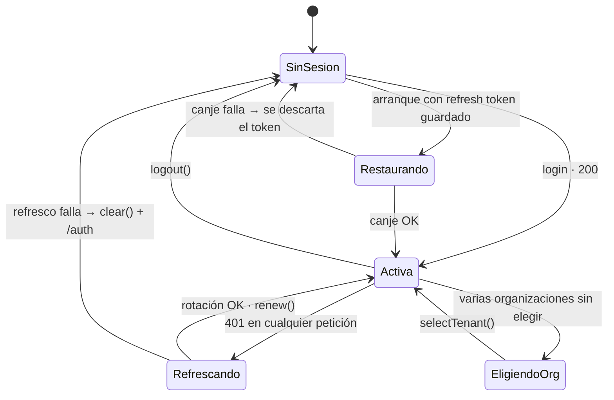

# Sesión y tokens

Dónde vive cada credencial, cómo se renueva y qué pasa cuando algo falla.

---

## El reparto

| Credencial | Dónde | Duración | Por qué ahí |
|---|---|---|---|
| **Access token** | Memoria (`SessionStore`) | Minutos (`exp` del JWT) | Dura poco y se vuelve a obtener. Guardarlo sería exponer de más sin ganar nada |
| **Refresh token** | `localStorage` (`mantra.refresh-token`) | La del servidor | Es lo único que hace que la sesión sobreviva a la recarga |

**No hay cookies.** La API entrega el refresh token **en el cuerpo del login**, así
que el frontend no puede convertirlo en `HttpOnly`: es una decisión del backend,
no una omisión de este repositorio.

## El ciclo



## Recuperación al arrancar

```ts
provideAppInitializer(() => inject(AuthService).restoreSession())
```

Corre **antes** de que el router evalúe el guard:

> *«Si no se esperara, alguien con sesión válida vería un parpadeo al login
> mientras el canje del refresh token está en vuelo. En el servidor no hay
> almacenamiento, así que resuelve de inmediato sin pedir nada.»*

Y cuando el canje falla:

```ts
catchError(() => {
  this.storage.clear();   // no reintentar en cada arranque contra el límite
  return of(false);
})
```

> *«un refresh token vencido o revocado no es un error que mostrar, es
> simplemente no haber iniciado sesión.»*

## Renovación: rotación completa, una sola en vuelo

`POST /iam/auth/token/refresh` **rota el par completo**: el token viejo deja de
servir. Eso convierte un robo en algo detectable del lado del servidor.

`TokenRefreshService` garantiza una sola petición en vuelo. Ver
[caché](../data-and-state/caching.md#lo-único-que-sí-deduplica).

### El reintento no recursa

```ts
return refresher.refresh().pipe(
  switchMap(() => next(withCredentials(request, session))),
  catchError((refreshError: unknown) => endSession(session, router, refreshError)),
);
```

> *«si la petición reintentada vuelve a dar 401, el error sube. Un interceptor que
> reintenta en bucle agota el límite de peticiones y deja la interfaz colgada sin
> decir nada.»*

## Cierre de sesión

```ts
logout(): void {
  // El aviso sale primero: el interceptor toma el access token del store al
  // suscribirse, y limpiar antes lo dejaría sin credencial.
  this.iam.logout().subscribe({ error: () => undefined });
  // Y la limpieza va YA, sin esperar la respuesta.
  this.clearLocal();
}
```

**Se limpia local pase lo que pase**:

> *«si la petición falla, la persona igual quiso salir, y dejarla adentro por un
> error de red sería lo peor de los dos mundos. El token local se descarta y el
> del servidor caduca solo.»*

### El orden al cerrar sesión

No es el intuitivo, y la versión intuitiva era un defecto.

Antes, `clearLocal()` vivía **dentro del callback de la respuesta**. Eso abría una
ventana de un viaje de red completo en la que el refresh token **seguía en
`localStorage`** — y la interfaz navega al login inmediatamente después de llamar
a `logout()`, con una navegación local e instantánea. La navegación ganaba
siempre. El borrado no llegaba a correr. **La siguiente recarga restauraba la
sesión que se acababa de cerrar.**

Lo destapó [la prueba de extremo a extremo](../testing/e2e-tests.md#por-qué-existen)
que vuelve a entrar a `/dashboard` después de salir. Ninguna prueba unitaria podía
verlo: todas hacían `flush()` de la respuesta, que es justo el caso en el que sí
funcionaba.

El orden actual resuelve las dos restricciones a la vez:

| Paso | Por qué en ese orden |
|---|---|
| 1 · `iam.logout().subscribe(…)` | El interceptor lee el access token del store al suscribirse. Limpiar antes lo dejaría sin credencial y el servidor no revocaría nada. |
| 2 · `clearLocal()`, sin esperar | Quien pulsó «cerrar sesión» ya salió. Ni la red ni una pestaña que se cierra pueden impedir el borrado. |

Un error en el aviso no cambia nada de lo que sigue: es cortesía hacia el
servidor, no la condición para salir.

### `logout`, no `logout-all`

> *«esa otra ruta cierra las sesiones de **todos** sus dispositivos, que es otra
> intención.»*

Cerrar sesión en el teléfono no debería cerrar la del consultorio. Que la API
tenga las dos y el cliente use la correcta es una decisión, no un descuido.

### Cierre por inactividad

`IdleLogoutService` cierra la sesión tras **15 minutos sin interacción**, con un
aviso 2 minutos antes. Está pensado para el dispositivo compartido —un
consultorio, una recepción—, donde «la sesión dura mientras el refresh token
sirva» es más de lo deseable.

Tres detalles que no son accidentales:

- Los eventos que cuentan como actividad son `pointerdown`, `keydown`, `scroll` y
  `focus`. **`mousemove` no está**: un ratón apoyado sobre una mesa que vibra
  mantendría la sesión abierta para siempre.
- Los oyentes se registran con `runOutsideAngular`: un `scroll` no debe disparar
  detección de cambios.
- El temporizador lo gobierna un `effect` sobre `session.isAuthenticated()`, así
  que arranca y se detiene solo, sin que nadie tenga que acordarse.

### Cierre entre pestañas

`watchSessionClosedElsewhere()` escucha el evento `storage` sobre
`mantra.refresh-token`, que dispara en **las otras** pestañas del mismo origen.

Sin esto, cerrar sesión en una pestaña dejaba la otra funcionando hasta que su
access token expirara. En un dispositivo compartido, eso es una sesión abierta
que alguien creyó haber cerrado.

No llama a la API —la otra pestaña ya lo hizo— y se ignora el `key === null` de
un `localStorage.clear()` ajeno, que no es nuestro cierre de sesión.

## El tenant activo

```ts
readonly activeTenantId = computed<string | null>(() => {
  const chosen = this.selectedTenantId();
  if (chosen !== null) return chosen;
  const tenants = this.tenants();
  return tenants.length === 1 ? (tenants[0] ?? null) : null;
});
```

Con varias organizaciones y ninguna elegida devuelve `null`, y entonces
**`X-Tenant-Id` no se manda**. Adivinar podría mostrar datos de la organización
equivocada.

`renew()` no lo toca; `start()` sí lo descarta.

## Lectura del token

Sin verificar la firma, y por una razón:

> *«Verificarla en el cliente no aportaría nada: la clave es del servidor y quien
> pueda alterar el token también puede alterar el código que lo comprueba.»*

Ante cualquier anomalía devuelve `null` en vez de lanzar. Y **solo `sub` es
obligatorio**:

> *«exigirlos acá sería ser más estricto que el contrato: un token sin `sid` se
> leería como ilegible y sacaría al login a alguien con sesión válida, sin
> explicación.»*

## Riesgos, y qué falta

### 1 · El refresh token es alcanzable por XSS · `MEDIUM`

Cualquier script en el origen puede leer `localStorage`. **Es el riesgo abierto
que queda**, y no se puede cerrar desde acá.

**Mitigado por:** cero `innerHTML`, cero scripts de terceros, 10 dependencias, y
[una CSP con `script-src` por hash](content-security-policy.md) que sirve el
servidor de renderizado.
**No es del frontend:** convertirlo en cookie `HttpOnly` exige que la API deje de
entregarlo en el cuerpo.

### 2 · Sin señal de MFA · `LOW`

El campo está siempre visible porque el backend no declara cuándo hace falta. Hay
un `TODO` en `login.ts`. **Es del backend**, no de acá.

### Cerrados

| Riesgo | Cómo se cerró |
|---|---|
| Sin cierre por inactividad | `IdleLogoutService`, 15 min con aviso a los 13 |
| Sin cierre entre pestañas | Oyente de `storage` sobre `mantra.refresh-token` |
| `isAccessTokenExpired` sin consumidor | El interceptor la usa para refrescar **antes** de mandar, no después del 401 |
| Sin CSP | Seis cabeceras de seguridad desde `src/server/security-headers.ts` |
| El borrado al salir podía no ocurrir | Ver [el orden al cerrar sesión](#el-orden-al-cerrar-sesión) |

## Lo que está bien y conviene no perder

| Práctica | |
|---|---|
| El access token nunca toca el disco | |
| El refresh token se descarta en cuanto deja de servir | |
| La rotación es completa | |
| El refresco es único en vuelo y no recursa | |
| El cierre de sesión limpia pase lo que pase, **y sin esperar a la red** | |
| La sesión se cierra sola por inactividad, y en todas las pestañas | |
| `logout` y no `logout-all` | |
| El tenant no se adivina | |
| El token no se verifica en el cliente **a propósito** | |
| El almacenamiento degrada sin romper | |

Ver [el modelo de amenazas](threat-model.md) y
[almacenamiento del navegador](browser-storage.md).
