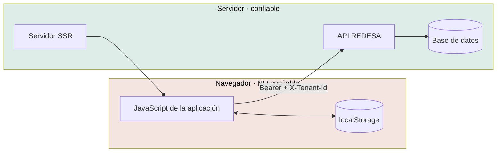

# Modelo de amenazas

Metodología **STRIDE**, alcance frontend. La autoridad de seguridad es la API;
acá se modela lo que el cliente puede exponer, filtrar o facilitar.

- **Fecha:** 2026-08-01
- **Alcance:** aplicación en el navegador, servidor SSR, almacenamiento local

---

## Activos

| Activo | Dónde | Sensibilidad |
|---|---|---|
| Refresh token | `localStorage` (`mantra.refresh-token`) | **Crítica** |
| Access token | Memoria (`SessionStore`) | **Crítica** |
| Claims del token (`sub`, `roles`, `tenants`, `name`, `tenantNames`) | Memoria, y visibles en el panel | Media |
| Identificador de organización activa | Memoria, cabecera `X-Tenant-Id` | Media |
| Datos clínicos (PHI) | **Ninguno se persiste hoy** | **Crítica** cuando existan |
| Preferencia de tema | `localStorage` | Nula |
| Código fuente del cliente | El paquete | Baja (es público por definición) |

## Fronteras de confianza



**Todo lo que cruza de izquierda a derecha es entrada no confiable para la API.**

---

## S · Suplantación

| # | Amenaza | Prob. | Impacto | Mitigación actual | Residual |
|---|---|---|---|---|---|
| S1 | Robo del refresh token por XSS | Baja | **Crítico** | Cero `innerHTML`, cero terceros, 10 dependencias | **Medio — sin CSP** |
| S2 | Token forjado para engañar a la interfaz | Media | Bajo | El token no se verifica en el cliente **a propósito**; la API valida cada petición | Bajo |
| S3 | Acceso a la sesión en un dispositivo compartido | Media | Alto | `logout()` limpia **pase lo que pase**; el refresh token expira del lado del servidor | **Medio — sin cierre por inactividad** |
| S4 | Suplantación por reutilización de un token robado | Baja | Crítico | El refresco **rota el par completo**: el viejo deja de servir | Bajo |

**S1 es la amenaza principal del frontend.** El vector es estrecho —no hay por
dónde inyectar un script— pero la consecuencia es máxima y **no hay CSP como
segunda línea**.

## T · Manipulación

| # | Amenaza | Prob. | Impacto | Mitigación | Residual |
|---|---|---|---|---|---|
| T1 | Manipular el token para ver más opciones | Media | **Bajo** | La interfaz mostraría de más y la API rechazaría cada petición | Bajo |
| T2 | Manipular `X-Tenant-Id` para leer otra organización | Media | Crítico | `selectTenant` valida contra el token; **la API valida de nuevo** | Bajo |
| T3 | Manipular `localStorage` para inyectar por el tema | Baja | Medio | El script valida contra dos cadenas exactas | **Muy bajo** |
| T4 | Un proxy que devuelve una respuesta falsa | Baja | Medio | `readApiError` devuelve `null` ante cualquier forma inesperada | Bajo |

**T1 es el ejemplo de por qué esconder no protege.** Alguien con las herramientas
de desarrollo puede darse todos los roles del token y ver todos los ítems del
menú. Al pulsar cualquiera, la API responde 403 y `errorToViewState` lo pinta
como S5.

## R · Repudio

| # | Amenaza | Prob. | Impacto | Mitigación | Residual |
|---|---|---|---|---|---|
| R1 | Negar haber hecho una acción | Media | Medio | Del lado del servidor. El token trae `sid` | Bajo |
| R2 | **No poder correlacionar un reporte con los registros** | **Alta** | Medio | S9 exige `requestId`, visible y copiable | Bajo |
| R3 | **No hay registro de lo que ve el usuario** | Alta | Medio | **Ninguna. No hay telemetría** | **Alto** |

**R2 está bien resuelto** y es una de las mejores decisiones del proyecto: el
tipo `UnexpectedErrorViewState` **exige** el identificador, así que el olvido no
compila.

**R3 no lo está**: sin telemetría, nadie sabe cuántos errores ve la gente. Ver
[reporte de errores](../observability/error-reporting.md).

## I · Divulgación de información

| # | Amenaza | Prob. | Impacto | Mitigación | Residual |
|---|---|---|---|---|---|
| I1 | Filtrar la existencia de un recurso por el mensaje de error | Media | Alto | **S6 descarta `message` y `details` a propósito** | **Muy bajo** |
| I2 | Enumerar cuentas por la recuperación de contraseña | Alta | Medio | El acuse es **idéntico** exista o no la cuenta | **Muy bajo** |
| I3 | Enumerar cuentas por la verificación de correo | Media | Bajo | Todos los fallos se cuentan igual (`'invalido'`) | Muy bajo |
| I4 | Un secreto en el paquete | Media | Crítico | **Imposible por construcción**: `generate-env.mjs` con lista blanca y tres validaciones | **Muy bajo** |
| I5 | Mapas de fuente en producción | Baja | Bajo | No se generan | Muy bajo |
| I6 | PHI en registros de consola | Media | **Crítico** | Solo dos `console.warn`, ninguno con datos | Bajo |
| I7 | Filtración a un tercero | Baja | Crítico | **Cero scripts de terceros**; tipografías autoalojadas | **Muy bajo** |
| I8 | `Referer` filtrando una URL sensible | Media | Medio | **Ninguna. No hay `Referrer-Policy`** | **Medio** |
| I9 | La aplicación en un iframe ajeno | Baja | Alto | **Ninguna. No hay `frame-ancestors` ni `X-Frame-Options`** | **Medio** |

### I1 merece detenerse

```ts
case 'NOT_FOUND':
  return notFound();   // se descartan message y details
```

> *«El backend puede incluir el identificador buscado, y repetirlo en pantalla
> confirmaría que la persona consultó por algo concreto. El estado S6 del M34
> existe justamente para no revelar si el recurso existe.»*

Y `NotFoundViewState` **no tiene campos de datos**, así que ni siquiera se puede
construir uno que filtre. **Es una regla de privacidad codificada en un tipo.**

### I7 y las tipografías

Autoalojarlas no es solo rendimiento: un CDN de tipografías ve la IP de cada
visitante. En salud, el tráfico ya es información.

## D · Denegación de servicio

| # | Amenaza | Prob. | Impacto | Mitigación | Residual |
|---|---|---|---|---|---|
| D1 | Bucle de refresco agotando el límite de la API | **Alta si se implementa mal** | Alto | El reintento **no recursa**; el refresco es **uno solo en vuelo** | **Muy bajo** |
| D2 | Refresco repetido en cada arranque con un token muerto | Media | Medio | El token guardado **se descarta** cuando el canje falla | Muy bajo |
| D3 | Un conjunto de valores enorme colgando la pantalla | Baja | Medio | `MAX_PAGES = 20`, con aviso explícito | Muy bajo |
| D4 | Peticiones sin timeout acumulándose | Media | Bajo | **Ninguna. No hay timeout ni cancelación** | **Medio** |

**D1 es el que el proyecto trata con más cuidado**, y la razón está escrita:

> *«Un interceptor que reintenta en bucle agota el límite de peticiones y deja la
> interfaz colgada sin decir nada.»*

## E · Elevación de privilegios

| # | Amenaza | Prob. | Impacto | Mitigación | Residual |
|---|---|---|---|---|---|
| E1 | Saltar el guard escribiendo la URL | Alta | **Bajo** | El guard corre igual; y si no corriera, la API rechaza | Muy bajo |
| E2 | Actuar sobre otra organización | Media | Crítico | `X-Tenant-Id` se valida en los dos lados | Bajo |
| E3 | Pedir la verificación de identidad de otro | Baja | Alto | **Ninguna ruta de `identity` recibe a quién se verifica**: el backend lo resuelve del usuario autenticado | **Muy bajo** |
| E4 | Ver una sección sin el rol | Media | **Bajo** | La API valida. La interfaz solo deja de ofrecerla | Bajo |

**E3 es una decisión de diseño del backend que el frontend respeta**, y está
anotada en `identity.client.ts`:

> *«Ninguna ruta recibe a quién se verifica: el backend lo resuelve del usuario
> autenticado en vez de leerlo del cuerpo, justamente para que nadie pueda pedir
> la verificación de otro.»*

---

## Riesgos residuales, ordenados

| # | Riesgo | Severidad | Qué falta |
|---|---|---|---|
| 1 | **Sin CSP** | **Alta** | La segunda línea contra S1 |
| 2 | **Sin cabeceras de seguridad** | **Alta** | I8, I9: `Referrer-Policy`, `frame-ancestors`, `nosniff`, HSTS |
| 3 | **Sin telemetría de errores** | Alta | R3: nadie detecta un incidente |
| 4 | Refresh token en `localStorage` | Media | Cookie `HttpOnly` — **decisión del backend**, no del frontend |
| 5 | Sin cierre por inactividad | Media | S3 |
| 6 | Sin cierre de sesión entre pestañas | Media | Cerrar en una deja la otra viva |
| 7 | Sin timeout ni cancelación | Media | D4 |
| 8 | Sin verificación automática de contrastes | Baja | Riesgo de lectura, no de seguridad |

**Los dos primeros son el mismo trabajo**: unas líneas en `src/server.ts`, con la
prueba de que no rompen el prerenderizado ni la carga de tipografías.

Ninguno se corrige en este trabajo documental: los ocho son cambios de producto.
Están en [el análisis de brechas](../reports/documentation-gap-analysis.md) y en
[el informe de preparación productiva](../reports/production-readiness.md).

## Revisión

Este modelo debe revisarse cuando:

- Aparezca la primera pantalla con PHI.
- Se agregue cualquier script de terceros.
- Se agregue una integración en tiempo real.
- Cambie el mecanismo de autenticación (por ejemplo, a cookies).
- Se añada telemetría.
